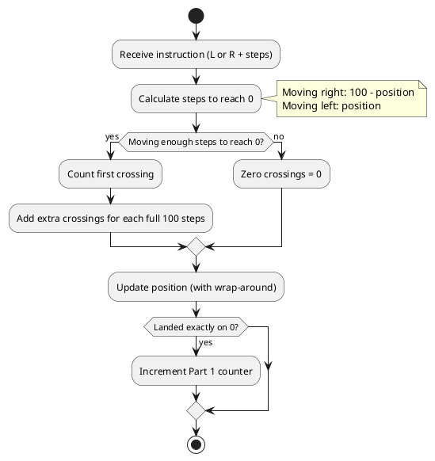
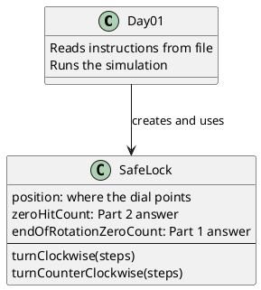

# Day 01: Secret Entrance

## The Problem in Plain English

Imagine a combination lock like on a safe - the kind with a dial that goes from 0 to 99. You're given a list of instructions like "turn left 68 clicks" or "turn right 48 clicks", and the dial starts pointing at 50.

**Part 1** asks: How many times does the dial end up pointing at 0 after following an instruction?

**Part 2** makes it trickier: How many times does the dial *pass through* 0, even if it doesn't stop there?

For example, if you're at position 5 and turn left 10 clicks, you'd pass through 0 on your way to 95. That counts in Part 2 but not Part 1.

---

## Why This Approach?

When I first read this problem, I thought about two things:

1. **It's a circle, not a line** - When you go past 99, you wrap around to 0. When you go below 0, you wrap to 99. This is like a clock, where after 12 comes 1 again.

2. **Part 2 needs to count "drive-bys"** - Just tracking where we end up isn't enough. We need to know if we crossed 0 along the way.

The key insight for Part 2 is: **if you move far enough, you might cross 0 multiple times!** If you're at position 50 and move 250 steps in one direction, you'll pass through 0 two or three times.

---

## How the Solution Works

### Part 1: Simple Position Tracking

This part is straightforward:

1. Start at position 50
2. For each instruction, update your position
3. If you land exactly on 0, count it

The only trick is handling the wrap-around. If you're at position 5 and move left 10 steps:
- 5 - 10 = -5
- But -5 on a 0-99 dial is actually 95 (wrap around!)

### Part 2: Counting Zero Crossings

Here's where it gets interesting. We need to figure out:

1. **How far is it to reach 0?**
   - If I'm at position 30 moving right (clockwise), I need 70 steps to hit 0
   - If I'm at position 30 moving left (counter-clockwise), I need 30 steps to hit 0

2. **How many times do I cross 0?**
   - First crossing: when I reach 0 the first time
   - Additional crossings: every 100 steps after that (a full loop around the dial)

---

## Visual: The Dial

```
          0
         /|\
       99   1
      /       \
    95    ●    5      ● = current position
     |   50   |
    90         10
      \       /
       85   15
         \|/
         ...
```

Moving RIGHT (clockwise): numbers go UP (0 → 1 → 2 → ... → 99 → 0)
Moving LEFT (counter-clockwise): numbers go DOWN (0 → 99 → 98 → ... → 1 → 0)

---

## The Algorithm (Flowchart)



---

## Walking Through an Example

Let's trace through these instructions starting at position 50:

```
L68  (turn left 68 clicks)
R48  (turn right 48 clicks)
```

**Step 1: L68 from position 50**
- Moving left 68 steps
- Distance to 0 when moving left from 50? Just 50 steps
- We're moving 68 steps, so we DO cross 0 ✓
- Extra crossings? (68 - 50) ÷ 100 = 0 extra
- **Zero crossings: 1**
- Final position: 50 - 68 = -18 → wraps to **82**

**Step 2: R48 from position 82**
- Moving right 48 steps
- Distance to 0 when moving right from 82? 100 - 82 = 18 steps
- We're moving 48 steps, so we DO cross 0 ✓
- Extra crossings? (48 - 18) ÷ 100 = 0 extra
- **Zero crossings: 1**
- Final position: 82 + 48 = 130 → wraps to **30**

**Results:**
- Part 1: Did we ever land exactly on 0? **No** (ended at 82, then 30)
- Part 2: Total zero crossings = 1 + 1 = **2**

---

## How the Code is Organized



The `SafeLock` class simulates the dial. It tracks:
- Current position
- How many times we landed on 0 (Part 1)
- How many times we crossed 0 (Part 2)

---

## Summary

| Part | What We're Counting | Approach |
|------|---------------------|----------|
| Part 1 | Times we land ON zero | Track position, check if it's 0 after each move |
| Part 2 | Times we pass THROUGH zero | Calculate distance to 0, then count full loops |

The solution is efficient because we don't simulate each click - we just do the math to figure out how many times we'd cross zero.
