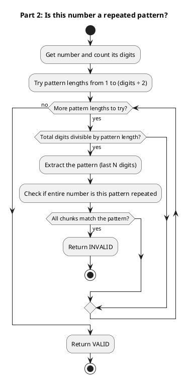
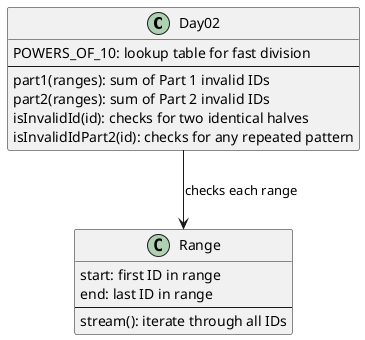

# Day 02: Gift Shop

## The Problem in Plain English

A mischievous young Elf added fake product IDs to the gift shop database. These fake IDs have a pattern: they're made by repeating the same digits.

**Part 1**: Find IDs that are exactly the same thing repeated twice:
- `55` = "5" repeated twice ✓
- `1212` = "12" repeated twice ✓
- `123123` = "123" repeated twice ✓
- `123` = not a repeat, just "123" once ✗

**Part 2**: Find IDs that are ANY pattern repeated 2 or more times:
- `123123` = "123" twice ✓
- `121212` = "12" three times ✓
- `1111` = "1" four times ✓
- `999` = "9" three times ✓

You're given ranges of IDs to check, and you need to sum up all the invalid ones.

---

## Why This Approach?

My first instinct was to convert numbers to strings and check for patterns. But that's slow for millions of IDs!

Instead, I realized we can use **math** to check for repetition:
- A number like `1212` is really `12 × 100 + 12`
- If I split it in half, both halves should be equal

The clever trick: **use division and remainder** to split a number into its halves without converting to a string.

For example, `1212` with 4 digits:
- Divide by 10² = 100 → gives `12` (first half)
- Remainder after dividing by 100 → gives `12` (second half)
- They match! It's a repeat.

---

## How the Solution Works

### Part 1: Check for Two Identical Halves

For a number to be "repeated twice":
1. It must have an **even** number of digits (can't split an odd-digit number in half)
2. The first half must equal the second half

```
Number: 123123 (6 digits)
Split point: 10^3 = 1000

First half:  123123 ÷ 1000 = 123
Second half: 123123 mod 1000 = 123

123 = 123? YES → Invalid ID!
```

### Part 2: Check for ANY Repeated Pattern

Now we need to check if a number is made of a pattern repeated 2, 3, 4, or more times.

The approach: try every possible pattern length!

```
Number: 121212 (6 digits)

Try pattern length 1: 6 ÷ 1 = 6 copies needed
  Pattern would be: 1
  But 121212 isn't "111111" ✗

Try pattern length 2: 6 ÷ 2 = 3 copies needed
  Pattern would be: 12
  Check: 12, 12, 12 → 121212 ✓ MATCH!
```

---

## The Algorithm (Flowchart)



---

## Walking Through Examples

### Example 1: Is `1212` invalid? (Part 1)

```
Digits: 4 (even ✓)
Split at: 10² = 100

First half:  1212 ÷ 100 = 12
Second half: 1212 mod 100 = 12

12 == 12? YES → Invalid!
```

### Example 2: Is `999` invalid? (Part 2)

```
Digits: 3

Pattern length 1: Does 3 ÷ 1 work? Yes, need 3 copies of a 1-digit pattern
  Pattern = 999 mod 10 = 9
  Check: 999 → 99 → 9 (all remainders are 9) ✓

All chunks are 9 → Invalid!
```

### Example 3: Is `12345` invalid?

```
Digits: 5 (odd, so Part 1 says VALID immediately)

Part 2 checks:
  Pattern length 1: 5 copies of same digit? 12345 mod 10 = 5, but 1234 mod 10 = 4 ✗
  Pattern length 2: 5 ÷ 2 = 2.5, not whole number, skip

No pattern works → Valid!
```

---

## Why Use Math Instead of Strings?

Converting millions of numbers to strings is slow. Division and modulo operations are **much faster**.

```
String approach:  "1212".substring(0,2).equals("1212".substring(2,4))
Math approach:    1212 / 100 == 1212 % 100
```

The math approach:
- No memory allocation for strings
- Just CPU arithmetic
- Works with very large numbers (the puzzle has 10+ digit IDs!)

---

## How the Code is Organized



---

## The Powers of 10 Trick

Instead of calculating `10^n` every time (which is slow), we pre-compute a lookup table:

```
POWERS_OF_10 = [1, 10, 100, 1000, 10000, 100000, ...]
```

To split a 6-digit number in half:
- Look up `POWERS_OF_10[3]` = 1000
- Divide and take remainder

This makes the solution blazing fast!

---

## Summary

| Part | What's Invalid? | How We Check |
|------|-----------------|--------------|
| Part 1 | Same thing twice (like `1212`) | Split in half, compare halves |
| Part 2 | Any pattern repeated 2+ times | Try all pattern lengths, check each |

The key insight is using **division and remainder** to examine digit patterns without slow string operations.
