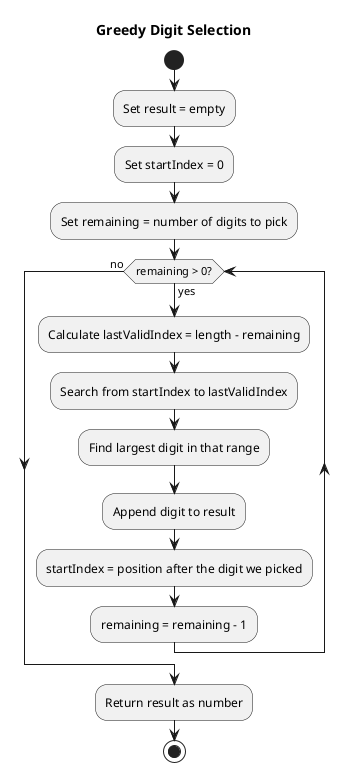
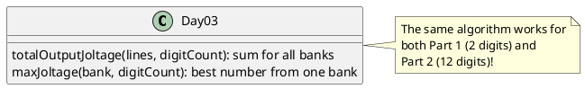

# Day 03: Lobby

## The Problem in Plain English

You have battery banks, each containing a row of batteries labeled with digits 1-9. You need to pick a certain number of batteries to power an escalator, and the "joltage" produced is the number formed by the digits you pick (in order).

**Part 1**: Pick exactly **2** batteries from each bank to make the biggest possible number.
**Part 2**: Pick exactly **12** batteries from each bank to make the biggest possible number.

The catch: you must pick batteries **in order** - you can't rearrange them!

**Example**: From `987654321111111`, if you pick 2 batteries:
- Picking positions 1 and 2 gives you `98` ✓ (best!)
- Picking positions 1 and 5 gives you `96`
- Picking positions 8 and 9 gives you `21`

---

## Why This Approach?

This is a classic "greedy" problem. At first, I thought about trying every possible combination, but that's way too slow for 12 picks from a long string.

The key insight: **always pick the biggest digit you can, as early as possible**.

Why? Because earlier positions are worth more. `90` beats `89` no matter what comes after. So we should be greedy - grab the biggest digit available, then repeat.

But there's a constraint: we need to leave enough digits after our pick for the remaining selections!

---

## How the Solution Works

### The Greedy Strategy

For each position we need to fill:
1. Look at all digits we could pick (not too far along!)
2. Pick the largest one
3. Start our next search AFTER that position

### The "Leave Room" Rule

If we need to pick `k` more digits, we can only look at positions up to `length - k`.

```
Bank: 987654321111111 (15 digits)
Need to pick: 2 digits

Position 1: Can look at indices 0-13 (must leave 1 for second pick)
            Best digit in 0-13: 9 at index 0
            Pick 9, move to index 1

Position 2: Can look at indices 1-14
            Best digit in 1-14: 8 at index 1
            Pick 8

Result: 98
```

---

## Visual Example

```
Bank: 811111111111119
      ↑             ↑
      8             9

Need 2 digits. Where can we look?

For 1st pick: indices 0 to 13 (leave room for 1 more)
  → Best is 8 at index 0

For 2nd pick: indices 1 to 14
  → Best is 9 at index 14!

Result: 89 (not 81!)
```

The algorithm correctly finds that even though 8 is first, the 9 at the end is reachable for the second position.

---

## The Algorithm (Flowchart)



---

## Walking Through Part 2

**Bank**: `234234234234278` (15 digits)
**Need**: 12 digits (skip 3)

The algorithm figures out which 3 digits to skip:

```
Round 1: Look at 0-3, best is 4 at index 2
Round 2: Look at 3-4, best is 3 at index 3 (wait, 4 at index 5!)

...the algorithm continues, finding optimal positions...

Result: 434234234278 (skipped the leading "23" and one "2")
```

---

## Why Greedy Works Here

In many problems, greedy approaches fail. But here it's optimal because:

1. **Digits have strict positional value** - A bigger digit in position 1 ALWAYS beats any arrangement of smaller digits. `9____` > `8xxxx` for any x.

2. **Order is preserved** - We can't reorder, so we just need to pick the best subset.

3. **No hidden costs** - Picking a digit doesn't make future picks more expensive.

---

## A Small Optimization

When we find a `9`, we stop searching immediately - there's nothing bigger!

```
for (int i = startIdx; i <= lastValidIdx; i++) {
    int digit = bank.charAt(i) - '0';
    if (digit > maxDigit) {
        maxDigit = digit;
        maxIdx = i;
        if (digit == 9) break;  // Can't do better!
    }
}
```

---

## How the Code is Organized



---

## Summary

| Concept | Explanation |
|---------|-------------|
| Greedy | Always pick the best available option |
| Constraint | Must leave enough digits for remaining picks |
| Why it works | Earlier positions dominate; can't reorder |

The solution is O(n × k) where n is bank length and k is digits to pick - very efficient!
