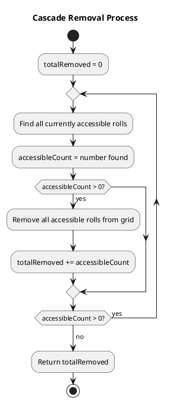
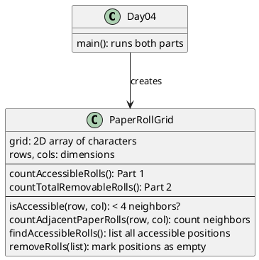

# Day 04: Printing Department

## The Problem in Plain English

Picture a warehouse floor covered with paper rolls (shown as `@`). Forklifts need to pick up these rolls, but they can only reach rolls that aren't too crowded.

**The Rule**: A forklift can only grab a roll if it has **fewer than 4 neighbors** (counting all 8 directions - including diagonals).

**Part 1**: How many rolls can forklifts access right now?

**Part 2**: If forklifts remove all accessible rolls, some previously blocked rolls become accessible. Keep removing until no more can be reached. How many total rolls get removed?

---

## Why This Approach?

This is a "simulation" problem. We need to:
1. Check each roll's neighbors
2. For Part 2, keep repeating until nothing changes

I realized Part 2 is like peeling an onion - the outer layers come off first, exposing inner layers that can then be removed.

---

## How the Solution Works

### Neighbor Counting

For each roll, we check all 8 surrounding cells:

```
[NW] [N] [NE]
[W]  [@] [E]
[SW] [S] [SE]
```

If fewer than 4 of these contain rolls, the forklift can reach it.

### Part 1: One-Time Count

Simply scan the grid and count accessible rolls:

```
..@@.@@@@.     Legend:
@@@.@.@.@@     @ = paper roll
@@@@@.@.@@     . = empty
@.@@@@..@.
```

For each `@`, count neighbors. If < 4 neighbors, it's accessible.

### Part 2: Cascade Removal



---

## Visual: The Cascade Effect

```
Initial:          After Round 1:      After Round 2:
@@@               .@.                 ...
@@@      →        @@@        →        .@.
@@@               .@.                 ...

Corners removed   Edges removed      Center removed
(3 neighbors)     (now 2 neighbors)  (now 0 neighbors)
```

Each removal "exposes" previously blocked rolls!

---

## Walking Through an Example

```
Grid:
..@@.
@@@.@
@@@@@
```

**Round 1 - Find accessible rolls:**

| Position | Neighbors | Accessible? |
|----------|-----------|-------------|
| (0,2) @ | 2 | Yes ✓ |
| (0,3) @ | 3 | Yes ✓ |
| (1,0) @ | 2 | Yes ✓ |
| (1,1) @ | 4 | No (too crowded) |
| (1,2) @ | 5 | No |
| ... | ... | ... |

Remove accessible rolls, repeat until stable.

---

## How the Code is Organized



---

## The 8-Direction Check

We check all 8 neighbors using a nested loop trick:

```
for deltaRow in [-1, 0, +1]:
    for deltaCol in [-1, 0, +1]:
        if (deltaRow, deltaCol) != (0, 0):  # Skip self!
            check position (row + deltaRow, col + deltaCol)
```

This elegantly covers: NW, N, NE, W, E, SW, S, SE

---

## Why Remove in Batches?

Important: we find ALL accessible rolls first, THEN remove them all at once.

If we removed one-by-one, the order would matter and we might get different results. Batch removal ensures consistent behavior.

```
Round 1: Find [A, B, C] accessible
Round 1: Remove A, B, C simultaneously
Round 2: Find [D, E] now accessible (were blocked by A, B, C)
...
```

---

## Summary

| Part | Question | Approach |
|------|----------|----------|
| Part 1 | How many accessible now? | Count rolls with < 4 neighbors |
| Part 2 | How many total after cascade? | Remove accessible, repeat until stable |

The cascade creates a "peeling" effect - outer rolls get removed first, exposing inner ones.
