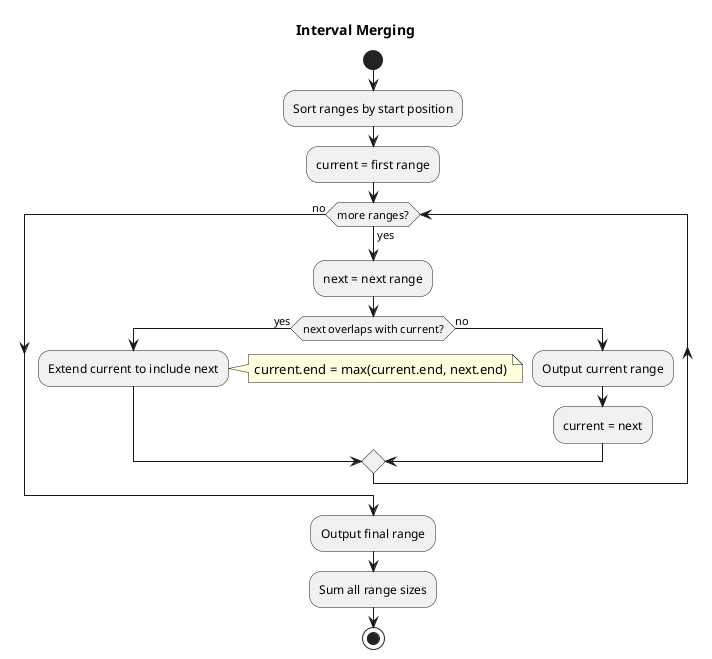
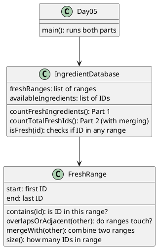

# Day 05: Cafeteria

## The Problem in Plain English

The kitchen has an ingredient database with two sections:
1. **Fresh ranges**: Lists of ID ranges like `3-5` meaning IDs 3, 4, and 5 are fresh
2. **Available ingredients**: Individual IDs to check

**Part 1**: How many of the available ingredient IDs fall within any fresh range?

**Part 2**: How many TOTAL distinct IDs are covered by all the fresh ranges combined? (Ranges might overlap!)

---

## Why This Approach?

**Part 1** is straightforward - just check if each ID falls in any range.

**Part 2** is trickier because ranges can overlap:
```
Range [10-14] and [12-18]
         10 11 12 13 14
               12 13 14 15 16 17 18

If we just add 5 + 7 = 12, we'd count 12, 13, 14 twice!
Correct answer: 9 distinct IDs (10-18)
```

The solution: **merge overlapping ranges first**, then count.

---

## How the Solution Works

### Part 1: Simple Range Check

For each available ingredient ID:
- Check if it falls within ANY of the fresh ranges
- If yes, count it

```
Ranges: [3-5], [10-14]
Available IDs: 1, 5, 8, 11

ID 1:  Not in [3-5] or [10-14] → Spoiled
ID 5:  In [3-5] → Fresh! ✓
ID 8:  Not in any range → Spoiled
ID 11: In [10-14] → Fresh! ✓

Answer: 2 fresh ingredients
```

### Part 2: Merge Then Count

The key insight: if we merge overlapping ranges first, we can simply add up their sizes.



---

## Visual: Merging Overlapping Ranges

```
Input:  [3-5]  [10-14]  [12-18]  [16-20]

Step 1: Sort by start
        [3-5]  [10-14]  [12-18]  [16-20]

Step 2: Merge overlaps
        [3-5]  [10----14]
                  [12----18]
                        [16----20]

        [3-5] stays alone (no overlap with 10-14)

        [10-14] overlaps with [12-18] → merge to [10-18]
        [10-18] overlaps with [16-20] → merge to [10-20]

Result: [3-5]  [10-20]
Sizes:    3   +   11   = 14 distinct IDs
```

---

## When Do Ranges Overlap?

Two ranges overlap (or touch) if the second one starts before the first one ends:

```
[10-14] and [12-18]: 12 ≤ 14+1? Yes → Overlap!
[10-14] and [16-18]: 16 ≤ 14+1? Yes → They touch!
[10-14] and [20-25]: 20 ≤ 14+1? No  → Gap between them
```

We use `≤ end+1` to also merge adjacent ranges like [3-5] and [6-8].

---

## Walking Through Part 2

```
Fresh ranges: [3-5], [10-14], [16-20], [12-18]

After sorting by start:
[3-5], [10-14], [12-18], [16-20]

Merging process:
1. Current = [3-5]
2. Next = [10-14]. Does 10 ≤ 5+1? No. Output [3-5], current = [10-14]
3. Next = [12-18]. Does 12 ≤ 14+1? Yes! Merge: current = [10-18]
4. Next = [16-20]. Does 16 ≤ 18+1? Yes! Merge: current = [10-20]
5. Done. Output [10-20]

Final ranges: [3-5], [10-20]
Total IDs: (5-3+1) + (20-10+1) = 3 + 11 = 14
```

---

## How the Code is Organized



---

## Why Sort First?

Sorting makes merging simple! Once sorted by start:
- We only need to compare each range with the previous one
- If they overlap, merge them
- If not, the previous range is "done" and can be output

Without sorting, we'd need to compare every range with every other range - much more complicated!

---

## Summary

| Part | Question | Approach |
|------|----------|----------|
| Part 1 | How many available IDs are fresh? | Check each ID against all ranges |
| Part 2 | How many total distinct fresh IDs? | Merge overlapping ranges, sum sizes |

The merge algorithm is a classic technique - you'll see it in many interval problems!
