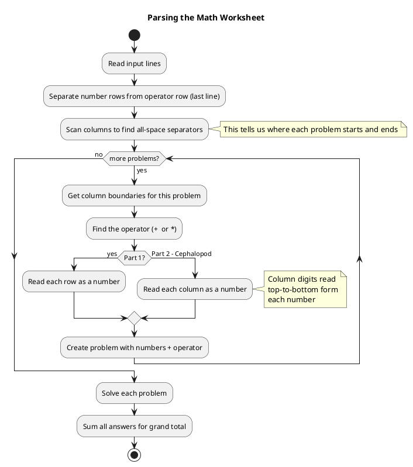
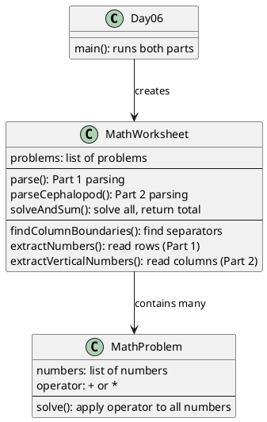

# Day 06: Trash Compactor

## The Problem in Plain English

You're stuck in a garbage smasher and a family of cephalopods offers to help. While waiting, you help their kid with math homework.

The worksheet looks weird - problems are arranged side by side in columns, not one below another:

```
123 328  51 64
45 64  387 23
6 98  215 314
*   +   *   +
```

**Part 1**: Read numbers the normal way (horizontally, row by row). Each vertical stack is one problem.
- Problem 1: 123 × 45 × 6
- Problem 2: 328 + 64 + 98

**Part 2**: Cephalopods read differently! They read each COLUMN as a number (top to bottom).
- Instead of "123" in row 1, they see column 1 = "1", "4", "6" = 146
- Everything changes!

---

## Why This Approach?

The tricky part isn't the math - it's **parsing** the worksheet.

Think about it:
- Problems sit side by side, separated by columns of spaces
- We need to find where each problem starts and ends
- Then extract numbers (differently for each part!)

I decided to:
1. **Scan for separator columns** - columns that are all spaces mark problem boundaries
2. **Extract numbers** - horizontally for Part 1, vertically for Part 2
3. **Do the math** - just addition or multiplication

---

## How the Solution Works

### Step 1: Find Problem Boundaries

Look at the input column by column. If a column is entirely spaces, that's a separator!

```
123 328  51 64
   ↑    ↑↑
   These columns are all-spaces = separators

Problem 1: columns 0-2
Problem 2: columns 4-6
Problem 3: columns 9-11
Problem 4: columns 13-14
```

### Step 2: Extract Numbers (Two Ways!)

**Part 1 - Read Rows:**
```
123 328  51 64        Problem 1 (cols 0-2):
45 64  387 23         Row 0: "123" → 123
6 98  215 314         Row 1: "45"  → 45
*   +   *   +         Row 2: "6"   → 6

                      Numbers: [123, 45, 6]
                      Operator: *
```

**Part 2 - Read Columns:**
```
123 328  51 64        Problem 1 (cols 0-2):
45 64  387 23         Col 0: '1','4','6' → 146
6 98  215 314         Col 1: '2','5',' ' → 25
*   +   *   +         Col 2: '3',' ','6' → 36

                      Numbers: [146, 25, 36]
                      Operator: *
```

The digits stack top-to-bottom to form each number!

### Step 3: Apply the Operator

Simply add (`+`) or multiply (`*`) all the numbers together.

---

## The Parsing Flow



---

## Visual: Part 1 vs Part 2

```
              Part 1: Human Style              Part 2: Cephalopod Style
              ─────────────────              ────────────────────────
Input:            1 2 3                            1 2 3
                  4 5                              4 5
                  6                                6

Read as:          Row 1 → 123                     Col 1 → 1,4,6 → 146
                  Row 2 → 45                      Col 2 → 2,5   → 25
                  Row 3 → 6                       Col 3 → 3,6   → 36

Numbers:          [123, 45, 6]                    [146, 25, 36]
```

Same input, completely different numbers!

---

## Walking Through the Example

**Input:**
```
123 328  51 64
45 64  387 23
6 98  215 314
*   +   *   +
```

### Part 1 (Human Reading)

| Problem | Numbers | Operator | Calculation | Result |
|---------|---------|----------|-------------|--------|
| 1 | 123, 45, 6 | × | 123 × 45 × 6 | 33,210 |
| 2 | 328, 64, 98 | + | 328 + 64 + 98 | 490 |
| 3 | 51, 387, 215 | × | 51 × 387 × 215 | 4,243,455 |
| 4 | 64, 23, 314 | + | 64 + 23 + 314 | 401 |

**Grand Total**: 33,210 + 490 + 4,243,455 + 401 = **4,277,556**

### Part 2 (Cephalopod Reading)

Reading right-to-left by column:

| Problem | Numbers (from columns) | Operator | Calculation | Result |
|---------|------------------------|----------|-------------|--------|
| Rightmost | 4, 431, 623 | + | 4 + 431 + 623 | 1,058 |
| 2nd from right | 175, 581, 32 | × | 175 × 581 × 32 | 3,253,600 |
| 3rd from right | 8, 248, 369 | + | 8 + 248 + 369 | 625 |
| Leftmost | 356, 24, 1 | × | 356 × 24 × 1 | 8,544 |

**Grand Total**: 1,058 + 3,253,600 + 625 + 8,544 = **3,263,827**

---

## How the Code is Organized



---

## The Column-Reading Trick

For Part 2, reading a column as a number works like this:

```
Column with digits '1', '4', '6' (top to bottom):

result = 0
result = 0 × 10 + 1 = 1
result = 1 × 10 + 4 = 14
result = 14 × 10 + 6 = 146

Final number: 146
```

Each digit shifts the previous result left (×10) and adds itself. This builds the number digit by digit without needing strings!

---

## Finding Separators

A column is a separator if EVERY row has a space (or nothing) at that position:

```
123 328  51
   ↑
   Column 3: Row 0 = ' ', Row 1 = ' ', Row 2 = ' '
   All spaces → Separator!

   Column 4: Row 0 = '3', Row 1 = '6', Row 2 = '9'
   Has digits → Not a separator
```

---

## Summary

| Part | How to Read | What Changes |
|------|-------------|--------------|
| Part 1 | Row by row (horizontal) | "123" on row 1 = number 123 |
| Part 2 | Column by column (vertical) | "1" over "4" over "6" = number 146 |

The clever insight: same worksheet, same layout, but *direction of reading* changes everything. Human math goes left-to-right; cephalopod math goes top-to-bottom!
