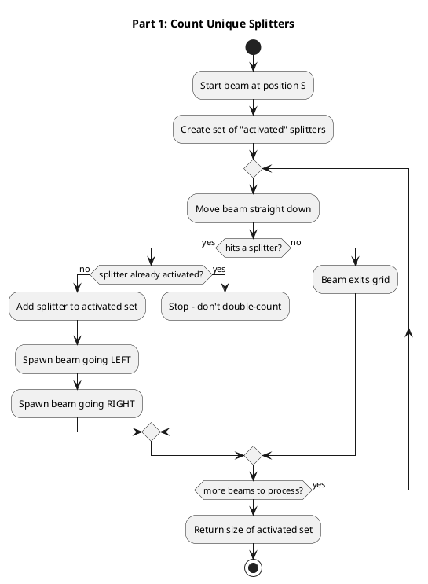
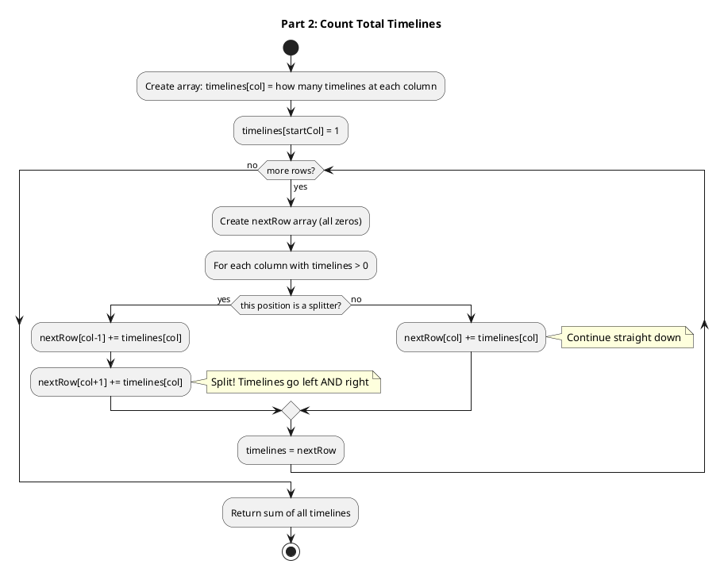
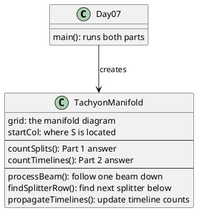

# Day 07: Laboratories

## The Problem in Plain English

You're trapped in a teleporter lab with a broken tachyon manifold. Picture a grid where a beam of light shoots down from the top. When it hits a splitter (`^`), it doesn't continue straight - it splits into two beams, one going left and one going right.

**The twist**: When two beams land in the same column, they **merge** into one beam!

```
.......S.......    ← Beam starts here
.......|.......    ← Goes straight down
......|^|......    ← Hits splitter, splits into 2 beams
......|.|......    ← 2 beams going down
.....|^|^|.....    ← Both hit splitters...
.....|.|.|.....    ← But middle overlaps! Only 3 beams, not 4
```

**Part 1**: How many splitters get activated?

**Part 2**: If we think of each split as creating "alternate timelines" (left path vs right path), how many total timelines exist when the particle finishes?

---

## Why This Approach?

### Part 1 - Just Count Unique Splitters

The key insight: **beams can merge**, so we don't need to track every single beam. We just need to know which splitters got hit.

If two beams reach the same splitter, we don't count it twice - it's still just one splitter.

### Part 2 - Count All Possible Paths

Now it's different! Even if beams "merge" in the same column, the number of **ways** to reach that column matters.

Think of it like this:
- Timeline A takes left-left path to column 5
- Timeline B takes right-right path to column 5
- Even though they're in the same column, they're still 2 separate timelines!

---

## How the Solution Works

### Part 1: BFS with Deduplication

We use **Breadth-First Search** to simulate beams spreading out:

1. Start a beam at column S
2. Move it down until it hits a splitter
3. If this splitter hasn't been activated before:
   - Mark it as activated
   - Spawn two new beams (left and right)
4. Repeat until all beams exit the grid



### Part 2: Row-by-Row Timeline Counting

Instead of tracking individual beams, we track **how many timelines** are at each column:

```
Row 0: [0,0,0,0,0,0,0,1,0,0,0,0,0,0,0]  ← 1 timeline at column 7

       After hitting splitter at row 2...

Row 3: [0,0,0,0,0,0,1,0,1,0,0,0,0,0,0]  ← 1 timeline at col 6, 1 at col 8
```

When timelines hit the same column (from different splitters), they ADD together:

```
Row 5: [0,0,0,0,0,1,0,2,0,1,0,0,0,0,0]  ← Column 7 has 2 timelines!
       (One came from left splitter, one from right splitter)
```



---

## Visual: Beams Merging vs Timelines Adding

```
Part 1 (counting splitters):      Part 2 (counting timelines):
─────────────────────────         ──────────────────────────
     S                                  S
     |                                  |
    |^|                                |^|
    |.|                                |.|
   |^|^|                              |^|^|
     ↓                                  ↓
One beam in middle              BUT 2 timelines in middle!
(beams merged)                  (each came a different way)
```

---

## Walking Through the Example

```
.......S.......
...............
.......^.......
...............
......^.^......
...............
.....^.^.^.....
...
```

### Part 1 Process

| Step | What Happens | Activated Splitters |
|------|--------------|---------------------|
| 1 | Beam from S hits splitter at (2,7) | 1 |
| 2 | Left beam hits splitter at (4,6) | 2 |
| 3 | Right beam hits splitter at (4,8) | 3 |
| 4 | Continue spreading... | ... |
| End | All splitters found | **21** |

### Part 2 Process

| Row | Timeline Count at Each Column | Total |
|-----|-------------------------------|-------|
| 0 | 1 at col 7 | 1 |
| 2 | Splits: 1 at col 6, 1 at col 8 | 2 |
| 4 | Each splits again, middle adds up | 4 |
| ... | Keeps branching | ... |
| End | Count all remaining timelines | **40** |

---

## The Merging Phenomenon

This is what makes the problem interesting:

```
Two splitters side by side:

    ^   ^           Left splitter sends beam right →  \
                                                        ↘  Both land in middle!
    Right splitter sends beam left →  /                ↗

In Part 1: Middle gets 1 beam (they merge)
In Part 2: Middle has 2 timelines (they came different ways)
```

---

## How the Code is Organized



---

## Why Different Algorithms?

**Part 1 uses BFS (search):**
- We only care about *which* splitters get hit
- If a splitter was already hit, skip it
- Set-based deduplication handles merging naturally

**Part 2 uses Dynamic Programming:**
- We care about *how many ways* to reach each spot
- Even merged paths count separately
- Array-based counting handles addition naturally

---

## The Timeline Branching Tree

```
                    S (1 timeline)
                    |
                    ^
                   / \
        (1)  LEFT   RIGHT  (1)
              |       |
              ^       ^
             /|       |\
           L  R       L  R
          (1)(1)     (1)(1)
              \     /
               \   /
                \ /
          (2 timelines here!)
```

Every split doubles the timelines going through that point. But when paths converge, timelines **add** instead of **merge**.

---

## Summary

| Part | Question | Key Insight |
|------|----------|-------------|
| Part 1 | How many splitters activated? | Beams merge - use a Set to avoid double-counting |
| Part 2 | How many total timelines? | Timelines add up - track count at each column |

The beautiful thing: Part 1 and Part 2 look at the same physical process but count different things. Splitters vs paths!
