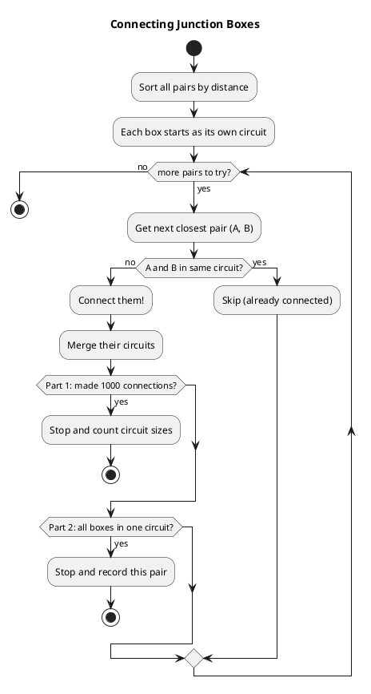
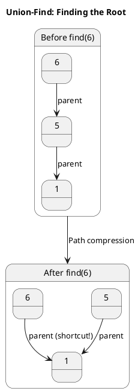
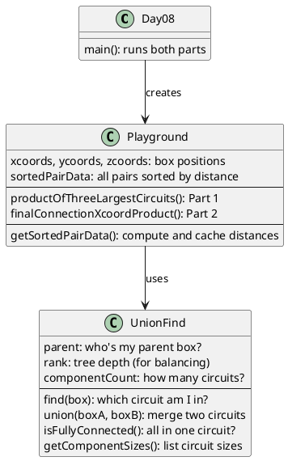

# Day 08: Playground

## The Problem in Plain English

Elves have hung junction boxes all over a giant underground playground. They want to connect them with strings of lights so electricity can flow between all boxes.

The catch: **they want to use as little wire as possible**, so they connect the closest pairs first.

```
Box A ●                      ● Box C
       \
        \  <- short wire
         \
          ● Box B            ● Box D

Connect A-B first (shortest distance)
Then maybe B-C, or C-D, etc.
```

When two boxes connect, they form a **circuit**. When you connect two boxes already in the same circuit, nothing changes (they can already share electricity).

**Part 1**: After making 1000 connections, what's the product of the 3 largest circuit sizes?

**Part 2**: Keep connecting until all boxes form ONE big circuit. What's the product of the X-coordinates of the final pair that connects everything?

---

## Why This Approach?

This is a classic **Minimum Spanning Tree** problem! We want to connect all boxes using the minimum total wire length.

The strategy:
1. Calculate the distance between every pair of boxes
2. Sort pairs by distance (shortest first)
3. Connect pairs in order, but skip if they're already in the same circuit
4. Track circuit sizes as we go

The key tool: **Union-Find** - a data structure that efficiently tells us if two items are in the same group, and lets us merge groups quickly.

---

## How the Solution Works

### Step 1: Calculate All Distances

For every pair of boxes, compute their 3D distance:

```
Box 1: (162, 817, 812)
Box 2: (425, 690, 689)

Distance² = (162-425)² + (817-690)² + (812-689)²
          = 263² + 127² + 123²
          = 69169 + 16129 + 15129
          = 100427

(We use squared distance to avoid slow square roots - ordering stays the same!)
```

### Step 2: Sort by Distance

Put all pairs in a list, sorted from closest to farthest:

```
Closest pairs:
1. Box 0 ↔ Box 19  (distance² = 100427)
2. Box 0 ↔ Box 7   (distance² = 123456)
3. Box 2 ↔ Box 13  (distance² = 145678)
...
```

### Step 3: Connect in Order

Go through the sorted list. For each pair:
- If they're in different circuits → connect them!
- If they're already in the same circuit → skip (wire would be wasted)



---

## Visual: Circuits Growing

```
Start: 5 boxes, each in own circuit
●  ●  ●  ●  ●
1  2  3  4  5   (5 circuits of size 1)

After connecting closest pair (1-3):
●──────●  ●  ●  ●
1      3  2  4  5   (4 circuits: one size-2, three size-1)

After connecting next closest (2-4):
●──────●  ●──●  ●
1      3  2  4  5   (3 circuits: two size-2, one size-1)

After connecting (1-5):
●──────●  ●──●  ●
│      │         │
└──────┴─────────┘
(Circuit 1 now has 3 boxes)

After connecting (2-3):
All 5 boxes in ONE circuit!
```

---

## The Union-Find Magic

Union-Find answers two questions super fast:
1. **Find**: Which circuit is this box in?
2. **Union**: Merge two circuits into one

The trick: organize boxes like a forest of trees. Each box points to a "parent." To find your circuit, follow parents until you reach the root.

```
Before merge:          After merging circuits:
    1                       1
   /|\                     /|\ \
  2 3 4                   2 3 4 5
                               |
    5                          6
    |
    6
```

**Path compression**: After finding the root, point directly to it. Future lookups are instant!



---

## Walking Through the Example

Given 20 junction boxes with coordinates like:
- Box 0: (162, 817, 812)
- Box 7: (431, 825, 988)
- Box 19: (425, 690, 689)

### Connection Order

| Step | Pair Connected | Result |
|------|----------------|--------|
| 1 | Box 0 ↔ Box 19 | Circuit: {0, 19} |
| 2 | Box 0 ↔ Box 7 | Circuit: {0, 7, 19} |
| 3 | Box 2 ↔ Box 13 | New circuit: {2, 13} |
| 4 | Box 7 ↔ Box 19 | **Skip!** (already same circuit) |
| ... | ... | ... |

### Part 1 Result (after 10 connections in example)

Circuit sizes: [5, 4, 2, 2, 1, 1, 1, 1, 1, 1, 1]

Three largest: 5 × 4 × 2 = **40**

### Part 2 Result

Keep connecting until everyone's in one circuit. The last connection in the example was:
- Box at (216, 146, 977) ↔ Box at (117, 168, 530)

X-coordinates: 216 × 117 = **25272**

---

## How the Code is Organized



---

## Why Squared Distance?

Instead of:
```
distance = sqrt((x1-x2)² + (y1-y2)² + (z1-z2)²)
```

We use:
```
distance² = (x1-x2)² + (y1-y2)² + (z1-z2)²
```

Why? Because if A is closer than B:
- distance(A) < distance(B)
- distance²(A) < distance²(B)

The ordering is the same, but we skip millions of slow square root calculations!

---

## The "Skip Already Connected" Insight

This is what makes Kruskal's algorithm work:

```
Circuits: {A, B, C} and {D, E}

Try to connect B and C:
  - find(B) = root of {A,B,C}
  - find(C) = root of {A,B,C}
  - Same root! Skip this connection.

Try to connect C and D:
  - find(C) = root of {A,B,C}
  - find(D) = root of {D,E}
  - Different roots! Connect them.
  - Now one circuit: {A,B,C,D,E}
```

Without this check, we'd create cycles and waste wire!

---

## Summary

| Part | Question | Approach |
|------|----------|----------|
| Part 1 | Product of 3 largest circuits after 1000 connections | Connect closest pairs, track circuit sizes |
| Part 2 | X-product of final connecting pair | Keep connecting until one circuit, record last pair |

The key insight: **sort by distance, connect greedily, use Union-Find to avoid cycles**. This is Kruskal's algorithm - a classic minimum spanning tree technique!
