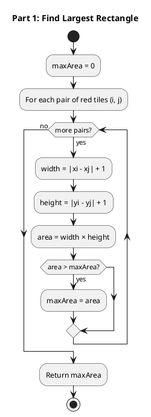
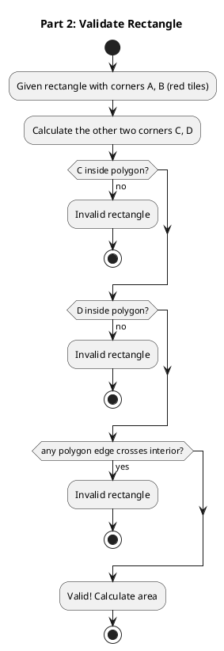
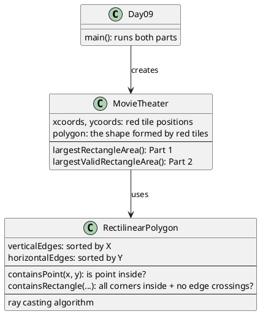

# Day 09: Movie Theater

## The Problem in Plain English

You're in a movie theater with a patterned tile floor. Some tiles are **red**, and the Elves want to find the biggest rectangle using red tiles as **opposite corners**.

```
..............
.......#...#..    # = red tiles
..............
..#....#......
..............
..#......#....
..............
.........#.#..
```

**Part 1**: Find any two red tiles, draw a rectangle between them, and maximize the area. Doesn't matter what's inside!

**Part 2**: Now there's a catch! Red tiles connect to each other with **green** tiles, forming a closed loop. The rectangle can only contain red or green tiles - no other colors!

```
..............
.......#XXX#..    # = red (corners)
.......XXXXX..    X = green (edges + interior)
..#XXXX#XXXX..
..XXXXXXXXXX..
..#XXXXXX#XX..
.........XXX..
.........#X#..
```

---

## Why This Approach?

### Part 1: Simple Brute Force

With N red tiles, there are N×(N-1)/2 possible pairs. For each pair, calculate the rectangle area:

```
Area = width × height
     = |x2 - x1 + 1| × |y2 - y1 + 1|
```

Just try all pairs and keep the maximum!

### Part 2: Polygon Containment

The red tiles form vertices of a **rectilinear polygon** (a shape with only horizontal and vertical edges). We need to check:

1. Are all 4 corners inside the polygon?
2. Does any polygon edge cut through the rectangle?

This requires geometry algorithms!

---

## How the Solution Works

### Part 1: Try All Pairs



### Part 2: Validate Against Polygon

For a rectangle to be valid in Part 2:



---

## Visual: Part 1 vs Part 2

### Part 1 Example (Area = 50)

```
..............
..OOOOOOOOOO..    Using red tiles at (2,5) and (11,1)
..OOOOOOOOOO..    as opposite corners
..OOOOOOOOOO..
..OOOOOOOOOO..
..OOOOOOOOOO..
..............
.........#.#..
```

This is the largest rectangle for Part 1 - doesn't matter what tiles are inside!

### Part 2 Example (Area = 24)

```
..............
.......#XXX#..
.......XXXXX..
..OOOOOOOOXX..    Using red tiles at (2,3) and (9,5)
..OOOOOOOOXX..    Rectangle only covers red/green tiles!
..OOOOOOOOXX..
.........XXX..
.........#X#..
```

The Part 1 winner (area=50) is invalid because it includes tiles that aren't red or green!

---

## The Point-in-Polygon Trick

To check if a point is inside the polygon, we use **ray casting**:

1. Draw an imaginary ray from the point going right
2. Count how many polygon edges it crosses
3. **Odd crossings = inside**, even crossings = outside

```
        ↓ Point P
   ┌────●────────→ ray
   │    ↑         crosses 1 edge
   │    │         (odd = inside!)
   │    │
   └────┘

        ↓ Point Q
───────●──────────→ ray
                   crosses 0 edges
   ┌────────┐      (even = outside!)
   │        │
   └────────┘
```

---

## Why Check for Edge Crossings?

A rectangle can have all 4 corners inside the polygon but still be invalid:

```
Polygon shape:              Invalid rectangle:

   ┌────────┐               ┌──OOOOO┐
   │        │               │  OOOOO│
   │   ┌────┘               │  ┌OOO─┘
   │   │                    │  │OOOOO  ← Part of rectangle
   │   │                    │  │OOOOO    goes outside polygon!
   └───┘                    └──┘
```

Even though corners might be inside, the rectangle's edge crosses the polygon boundary. We must check for this!

---

## Walking Through the Example

**Red tiles**: (7,1), (11,1), (11,7), (9,7), (9,5), (2,5), (2,3), (7,3)

### Part 1 Calculation

| Pair | Width | Height | Area |
|------|-------|--------|------|
| (7,1) ↔ (2,3) | 6 | 3 | 18 |
| (7,1) ↔ (11,7) | 5 | 7 | 35 |
| (2,5) ↔ (11,1) | 10 | 5 | **50** |
| ... | ... | ... | ... |

**Maximum**: 50

### Part 2 Validation

The (2,5) ↔ (11,1) rectangle with area 50:
- Corner (2,1): **Not inside polygon!** (outside the red/green area)
- Invalid for Part 2

Check (2,3) ↔ (9,5) rectangle:
- All 4 corners inside polygon: Yes
- No polygon edges cross interior: Yes
- Area: 8 × 3 = 24

**Maximum valid**: 24

---

## How the Code is Organized



---

## The Rectilinear Polygon

Red tiles form vertices of a closed shape. Consecutive tiles connect with horizontal or vertical lines:

```
(7,1) → (11,1)    horizontal line
(11,1) → (11,7)   vertical line
(11,7) → (9,7)    horizontal line
... and so on back to (7,1)
```

This creates a polygon where all edges are axis-aligned (no diagonals). Everything inside the boundary is "green" in Part 2.

---

## Edge Storage for Fast Lookups

We organize edges by their coordinate for quick searches:

**Vertical edges** (grouped by X-coordinate):
```
X=2:  edges from Y=3 to Y=5
X=7:  edges from Y=1 to Y=3
X=9:  edges from Y=5 to Y=7
X=11: edges from Y=1 to Y=7
```

**Horizontal edges** (grouped by Y-coordinate):
```
Y=1:  edge from X=7 to X=11
Y=3:  edge from X=2 to X=7
Y=5:  edges from X=2 to X=9
Y=7:  edge from X=9 to X=11
```

This lets us quickly find "all vertical edges between X=3 and X=8" when checking if a rectangle is crossed by polygon edges.

---

## Summary

| Part | Question | Approach |
|------|----------|----------|
| Part 1 | Largest rectangle with red corners | Try all pairs, compute area |
| Part 2 | Largest valid rectangle (only red/green) | Check if rectangle fits inside polygon |

The key insight for Part 2: **the red tiles trace out a polygon**, and we can only use space inside that polygon. Ray casting tells us what's inside!
