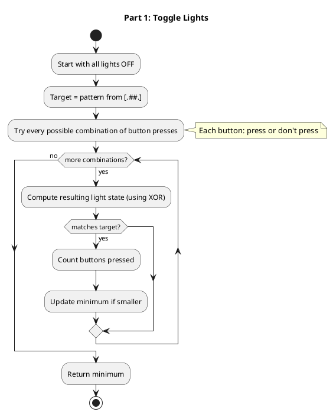
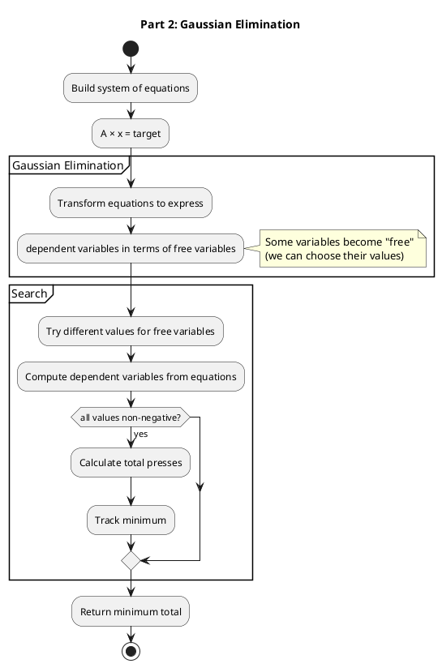
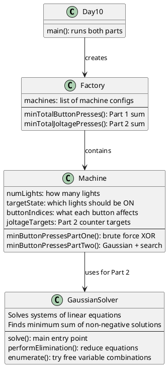

# Day 10: Factory

## The Problem in Plain English

You're in a factory with broken machines. Each machine has:
- **Indicator lights** that can be ON or OFF
- **Buttons** that affect multiple lights/counters at once
- **Target states** you need to reach

**Part 1**: Lights toggle (ON→OFF or OFF→ON) when you press a button. Find the minimum number of button presses to match the target light pattern.

**Part 2**: Now the buttons affect joltage counters instead. Each press **adds 1** to certain counters. Find the minimum total presses to reach target counter values.

```
Machine: [.##.] (3) (1,3) (2) (2,3) (0,2) (0,1) {3,5,4,7}

[.##.]  = Target: light 0 OFF, lights 1&2 ON, light 3 OFF
(0,2)   = This button toggles lights 0 and 2
{3,5,4,7} = Part 2 targets: counter 0=3, counter 1=5, etc.
```

---

## Why Different Approaches for Part 1 and Part 2?

### Part 1: Toggle Logic (XOR)

When you toggle a light twice, it goes back to its original state!
- OFF → ON → OFF (two presses cancel out)

This means each button is either pressed **0 times or 1 time**. More than once is pointless.

With N buttons, there are only 2^N possible combinations. We can try them all!

### Part 2: Addition Logic

Counters only go UP. Pressing a button 5 times adds 5 to certain counters.

Now buttons can be pressed **any number of times** (0, 1, 2, 3, ...). We can't try all combinations!

We need smarter math: **Gaussian elimination** (a fancy way to solve systems of equations).

---

## How the Solution Works

### Part 1: Try All Combinations



**Why XOR?**

XOR (exclusive or) is perfect for toggles:
- 0 XOR 1 = 1 (OFF → ON)
- 1 XOR 1 = 0 (ON → OFF)
- 0 XOR 0 = 0 (stay OFF)
- 1 XOR 0 = 1 (stay ON)

XORing a button's mask with the current state flips exactly the right lights!

### Part 2: Solve Equations

We need to find how many times to press each button.

```
Button 0 affects counter 3           →  x₀ added to counter 3
Button 1 affects counters 1 and 3    →  x₁ added to counters 1, 3
Button 2 affects counter 2           →  x₂ added to counter 2
...

Target: counters should be {3, 5, 4, 7}
```

This creates a system of equations:

```
counter 0: x₄ + x₅ = 3
counter 1: x₁ + x₅ = 5
counter 2: x₂ + x₃ + x₄ = 4
counter 3: x₀ + x₁ + x₃ = 7
```

We need to find non-negative integers x₀, x₁, x₂... that:
1. Satisfy all equations
2. Minimize the total (x₀ + x₁ + x₂ + ...)



---

## Visual: Part 1 Toggle Example

```
Machine: [.##.] with buttons (0,2) and (0,1)

Target state:    [.##.]  = lights 1,2 ON, lights 0,3 OFF

Button (0,2) toggles lights 0 and 2:
  [....] → [#.#.]

Button (0,1) toggles lights 0 and 1:
  [#.#.] → [.##.]  ✓ Matches target!

Only 2 presses needed!
```

**How XOR works:**

```
Initial:   0000  (all OFF)
Press (0,2): 0000 XOR 0101 = 0101  (lights 0,2 ON)
Press (0,1): 0101 XOR 0011 = 0110  (lights 1,2 ON) ✓
```

---

## Walking Through the Example

### Part 1

**Machine 1**: `[.##.] (3) (1,3) (2) (2,3) (0,2) (0,1) {3,5,4,7}`

Target: `0110` (binary: lights 1 and 2 ON)

| Buttons Pressed | Result | Presses |
|-----------------|--------|---------|
| (3), (1,3), (2) | 0110 | 3 |
| (0,2), (0,1) | 0110 | **2** |
| (3), (2), (2,3), (0,2), (0,1) | 0110 | 5 |

Minimum: **2 presses**

**Total for all 3 machines**: 2 + 3 + 2 = **7**

### Part 2

**Machine 1**: Target counters `{3, 5, 4, 7}`

One solution:
- (3) once: counter 3 gets +1
- (1,3) three times: counters 1,3 get +3 each
- (2,3) three times: counters 2,3 get +3 each
- (0,2) once: counters 0,2 get +1 each
- (0,1) twice: counters 0,1 get +2 each

Result: counters = {3, 5, 4, 7} with **10 total presses**

**Total for all 3 machines**: 10 + 12 + 11 = **33**

---

## How the Code is Organized



---

## What is Gaussian Elimination?

It's a method to simplify systems of equations. The idea:

**Before:**
```
x + 2y + z = 5
2x + y + z = 4
```

**After elimination:**
```
x = 5 - 2y - z
(We "solved" for x in terms of y and z)
```

Now y and z are "free variables" - we can pick their values. Then x is determined.

For our problem:
1. Eliminate variables until some become "free"
2. Try different values for free variables
3. Check if dependent variables come out as non-negative integers
4. Find the combination with minimum total

---

## Why Part 1 is Simpler

| Aspect | Part 1 (Toggles) | Part 2 (Counters) |
|--------|------------------|-------------------|
| Operation | XOR (toggle) | Addition |
| Possible presses per button | 0 or 1 | 0, 1, 2, 3, ... |
| Search space | 2^N combinations | Infinite! |
| Solution | Brute force | Linear algebra |

For Part 1, pressing a button twice is the same as not pressing it at all. This drastically limits what we need to check!

---

## Summary

| Part | Goal | Method |
|------|------|--------|
| Part 1 | Toggle lights to match pattern | Try all 2^N button combinations (XOR) |
| Part 2 | Set counters to target values | Gaussian elimination + search for minimum sum |

The key insight: **toggle operations allow brute force** (limited combinations), but **additive operations need algebra** (infinite possibilities without smart reduction).
