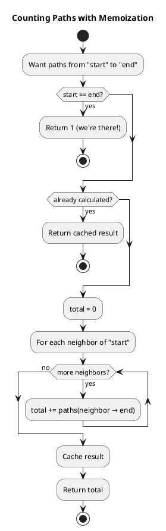
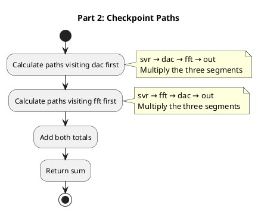
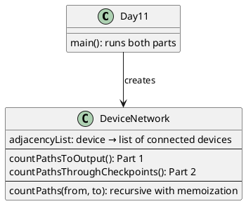

# Day 11: Reactor

## The Problem in Plain English

You're in a reactor room with a tangle of cables connecting devices. Data flows through these connections in ONE direction only (like one-way streets).

Each device has outputs that connect to other devices:
```
aaa: you hhh     ← Device 'aaa' outputs to 'you' and 'hhh'
you: bbb ccc     ← Device 'you' outputs to 'bbb' and 'ccc'
```

**Part 1**: Starting from device "you", how many different paths can data take to reach "out"?

**Part 2**: Now start from "svr". How many paths go from "svr" to "out" AND pass through BOTH "dac" AND "fft"?

---

## Why This Approach?

### Part 1: Count Paths in a Network

The devices form a **Directed Acyclic Graph** (DAG) - connections go one way and there are no loops.

For path counting in a DAG, we use a simple idea:
- **Number of paths from A to C** = sum of paths through each neighbor
- If A connects to B1 and B2:
  - `paths(A→C) = paths(B1→C) + paths(B2→C)`

We use **memoization** (caching) so we don't recompute the same thing twice.

### Part 2: Paths Through Two Checkpoints

If a path must visit BOTH "dac" AND "fft", there are only two orderings:
1. Visit dac FIRST, then fft
2. Visit fft FIRST, then dac

For each ordering, we can split the counting:
```
svr → dac → fft → out

Total paths = (paths svr→dac) × (paths dac→fft) × (paths fft→out)
```

Multiply because each segment can combine with any path from the other segments!

---

## How the Solution Works

### Part 1: Recursive Path Counting



### Part 2: Combine Segments



---

## Visual: Part 1 Example Network

```
         you ─→ bbb ─→ ddd ─→ ggg ─→ out
          ↓      ↓
          ↓      eee ─────────────→ out
          ↓
          ccc ─→ ddd ─→ ggg ─→ out
          ↓   ↓
          ↓   eee ─────────────→ out
          ↓
          fff ─────────────────→ out
```

**Counting paths from "you" to "out":**

| Node | Neighbors | Path Count | Calculation |
|------|-----------|------------|-------------|
| out | - | 1 | (destination) |
| ggg | out | 1 | 1 |
| eee | out | 1 | 1 |
| fff | out | 1 | 1 |
| ddd | ggg | 1 | paths(ggg) = 1 |
| bbb | ddd, eee | 2 | 1 + 1 |
| ccc | ddd, eee, fff | 3 | 1 + 1 + 1 |
| you | bbb, ccc | **5** | 2 + 3 |

**Answer**: 5 paths!

---

## Walking Through the Paths

Let's list all 5 paths from "you" to "out":

1. `you → bbb → ddd → ggg → out`
2. `you → bbb → eee → out`
3. `you → ccc → ddd → ggg → out`
4. `you → ccc → eee → out`
5. `you → ccc → fff → out`

Each path represents one possible route data can take through the network.

---

## Visual: Part 2 Example

```
svr → aaa → fft → ccc → ddd → hub → fff → ggg → out
 ↓                 ↓                  ↓
 ↓                 eee → dac → fff → hhh → out
 ↓
 bbb → tty → ccc → ...
```

**All 8 paths from svr to out:**
```
1. svr,aaa,fft,ccc,ddd,hub,fff,ggg,out    (has fft, no dac)
2. svr,aaa,fft,ccc,ddd,hub,fff,hhh,out    (has fft, no dac)
3. svr,aaa,fft,ccc,eee,dac,fff,ggg,out    (has fft AND dac!) ✓
4. svr,aaa,fft,ccc,eee,dac,fff,hhh,out    (has fft AND dac!) ✓
5. svr,bbb,tty,ccc,ddd,hub,fff,ggg,out    (no fft, no dac)
6. svr,bbb,tty,ccc,ddd,hub,fff,hhh,out    (no fft, no dac)
7. svr,bbb,tty,ccc,eee,dac,fff,ggg,out    (has dac, no fft)
8. svr,bbb,tty,ccc,eee,dac,fff,hhh,out    (has dac, no fft)
```

**Only 2 paths** pass through both dac AND fft!

---

## The Multiplication Trick

Why can we multiply segment counts?

Consider `svr → fft → dac → out`:

```
svr → fft:  1 way  (via aaa)
fft → dac:  1 way  (via ccc→eee)
dac → out:  2 ways (via fff→ggg or fff→hhh)

Total: 1 × 1 × 2 = 2 paths
```

This works because:
- Each way to get svr→fft can combine with...
- Each way to get fft→dac can combine with...
- Each way to get dac→out

It's like choosing from a menu: 3 appetizers × 4 mains × 2 desserts = 24 possible meals!

---

## How the Code is Organized



---

## Why Memoization Matters

Without caching, we'd count the same sub-paths over and over:

```
Without memoization:
  you → bbb → ddd → (count from ddd)
  you → ccc → ddd → (count from ddd AGAIN!)

With memoization:
  First time: count(ddd→out) = 1, store in cache
  Second time: lookup cache, return 1 immediately!
```

For large networks, this makes the difference between seconds and hours.

---

## The Key Insight for Part 2

If you need to visit A and B (in any order), you have two cases:

**Case 1: A first**
```
start → A → B → end
```

**Case 2: B first**
```
start → B → A → end
```

Total = Case 1 + Case 2

But wait! What if there's no path from A to B? Then `paths(A→B) = 0`, making that case contribute nothing. The math handles it automatically!

---

## Summary

| Part | Question | Method |
|------|----------|--------|
| Part 1 | Count paths you→out | Recursive counting with memoization |
| Part 2 | Count paths svr→out through dac AND fft | Split into segments, multiply, add both orderings |

The key insights:
- **DAGs allow simple counting**: paths from A = sum of paths from A's neighbors
- **Memoization prevents redundant work**: cache results for reuse
- **Checkpoints split the problem**: multiply segment counts, add orderings
