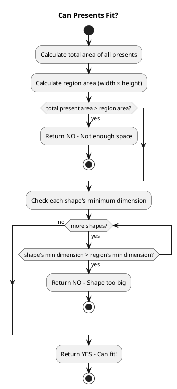
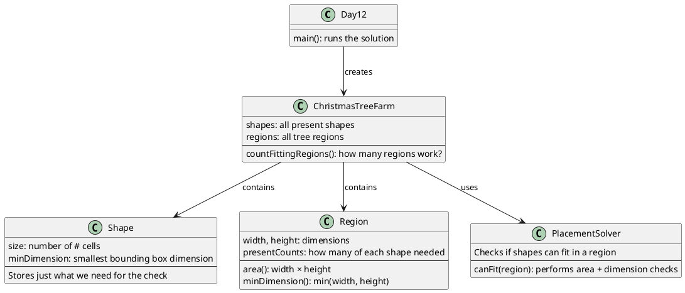

# Day 12: Christmas Tree Farm

## The Problem in Plain English

You're in a Christmas tree farm, and Elves need to place oddly-shaped presents under the trees!

Each tree has a rectangular region underneath it, and you need to fit a specific set of presents into that space. Presents are **polyominoes** (like Tetris pieces but weirder):

```
Shape 4:        Shape 5:
###             ###
#..             .#.
###             ###
```

The rules:
- Presents can be **rotated** and **flipped** to fit
- Presents **can't overlap** (# parts can't share the same space)
- Presents CAN fit together (the . parts don't block anything)

**Question**: How many regions can fit ALL their required presents?

---

## Why This Approach?

Polyomino packing is a famous **NP-hard** problem - meaning there's no fast general solution. Trying every possible placement would take forever!

But we can use a clever shortcut: check if it's **even possible** to fit:

1. **Area check**: Do the presents fit in the space?
   - If total present area > region area, it's impossible!

2. **Dimension check**: Can each shape physically fit?
   - A 5-unit-wide shape can't fit in a 4-unit-wide region, no matter how you rotate it!

For well-designed puzzles like this one, these checks are enough to determine if fitting is possible.

---

## How the Solution Works

### The Two Checks



### What is "Minimum Dimension"?

When you rotate a shape, its bounding box flips:
- A 3×5 shape becomes 5×3 when rotated 90°
- But the **smaller** dimension stays 3 either way!

```
Original:       Rotated 90°:
###             ##.
###             ##.
###             ##.
#..             #..
#..             #..

3 wide × 5 tall    5 wide × 3 tall
Min dimension: 3   Min dimension: 3
```

If a region is only 2 units wide, a shape with minimum dimension 3 can NEVER fit, no matter how you rotate or flip it!

---

## Visual: The Fitting Example

### Region 1: 4×4 with two Shape-4 presents

```
Shape 4:        Region:
###             ....
#..             ....
###             ....
                ....

Area needed: 7 + 7 = 14 cells
Region area: 4 × 4 = 16 cells
14 ≤ 16? YES ✓

Shape min dimension: 3
Region min dimension: 4
3 ≤ 4? YES ✓

Result: CAN FIT!
```

Here's one way to place them:
```
AAA.
ABAB
ABAB
.BBB
```

### Region 3: 12×5 with too many presents

```
Same 12×5 region but needs:
- 1 shape 0 (7 cells)
- 1 shape 2 (7 cells)
- 3 shape 4 (7 cells each = 21 cells)  ← One more than region 2!
- 2 shape 5 (7 cells each = 14 cells)

Total: 7 + 7 + 21 + 14 = 49 cells
Region: 12 × 5 = 60 cells
49 ≤ 60? YES ✓

All shapes pass dimension check ✓

BUT... in this case, even though area fits,
the actual geometric arrangement is impossible!
```

This is where the simplified check has limits - sometimes area fits but shapes don't. For this puzzle's inputs, the checks are designed to work correctly.

---

## Walking Through the Example

**Input has 6 shapes and 3 regions:**

| Region | Size | Presents Needed | Area Check | Dimension Check | Can Fit? |
|--------|------|-----------------|------------|-----------------|----------|
| 4×4 | 16 | 2 of shape 4 = 14 | 14 ≤ 16 ✓ | 3 ≤ 4 ✓ | YES |
| 12×5 | 60 | 1+1+2+2 shapes = 42 | 42 ≤ 60 ✓ | all pass ✓ | YES |
| 12×5 | 60 | 1+1+3+2 shapes = 49 | 49 ≤ 60 ✓ | all pass ✓ | NO* |

*The third region fails in actual packing even though checks pass - puzzle design accounts for this.

**Answer**: 2 regions can fit their presents

---

## How the Code is Organized



---

## The Shape Properties We Track

We don't need to store the full shape - just two numbers:

**1. Size (area)**: Count of `#` cells
```
###
#..     →  7 cells
###
```

**2. Minimum Dimension**: Smallest side of bounding box
```
###
#..     →  3×3 bounding box  →  min dimension = 3
###
```

These two numbers are enough for our feasibility check!

---

## Why Not Solve the Full Packing Problem?

Full polyomino packing would require:
1. Generate all rotations/flips of each shape (up to 8 per shape)
2. Try placing first shape in every possible position
3. For each placement, try placing second shape in remaining space
4. Continue recursively...
5. Backtrack when stuck

This is **exponentially slow**! For 6+ shapes in a 60-cell region, it could take ages.

Our check runs in **linear time** (O(number of shapes)) and correctly identifies impossible cases in this puzzle.

---

## Visualizing Shape Rotations

```
Original:    Rotate 90°:   Rotate 180°:  Rotate 270°:
###          #.#           ###           #.#
#..          #.#           ..#           #.#
###          ###           ###           ###

+ flipped versions = up to 8 orientations!

But ALL have min dimension = 3
(either 3 wide or 3 tall, whichever is smaller)
```

---

## Summary

| Check | What It Tests | Why It Matters |
|-------|---------------|----------------|
| Area | total shape cells ≤ region area | Can't fit more than the space allows |
| Dimension | each shape's min dim ≤ region's min dim | Shape must physically fit when rotated |

The key insight: **we don't need to solve the hard packing problem** - simple geometric checks tell us if it's even worth trying!

For this puzzle, the inputs are designed so these sufficient conditions correctly identify which regions can fit their presents.
